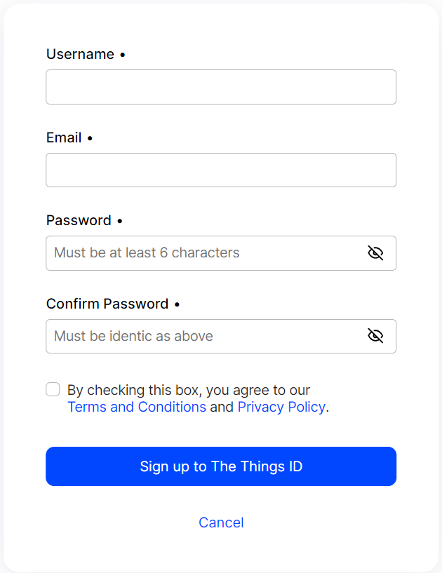

# lorawan-gateway
This repository contains Getting Started of some LoRaWAN Gateways sold in Cosmic.id Store.

## Compatible Gateways

* [RAK 7268](https://www.tokopedia.com/cosmic-iot/gateway-lora-lorawan-merk-rak-tipe-rak7268c-wisgate-edge-lite-2) 

## Step by Step

1. Register an Account in [The Things Network](https://au1.cloud.thethings.network/). 
2. Open the RAK Gateway 7268 Web Interface. 
3. Get Dev EUI of the LoRaWAN Gateway through Web Interface or through the backplate of the RAK. 
    * Dev EUI stated on the Web Interface.  
    * Dev EUI printed on the Backplate of RAK LoRaWAN Gateway. 

4. Register your LoRaWAN Gateway to the The Things Network. Please input the Gateway EUI as stated on the step 3. 
5. The next detailed form will appear. Please fill the parameters as below then click Register Gateway : 
    * Gateway Name: Pick your own name
    * Frequency Plan : Asia 920-923 MHz (AS923 Group 2) with only default channels

6. Connect the LoRaWAN Gateway to the Internet through LAN Ethernet or WiFi. If everything is OK, then the dashboard of the TTN Gateway will appear Online.

Congratulations! You have successfully connect your LoRaWAN Gateway to the LoRaWAN Network Server The Things Network.

